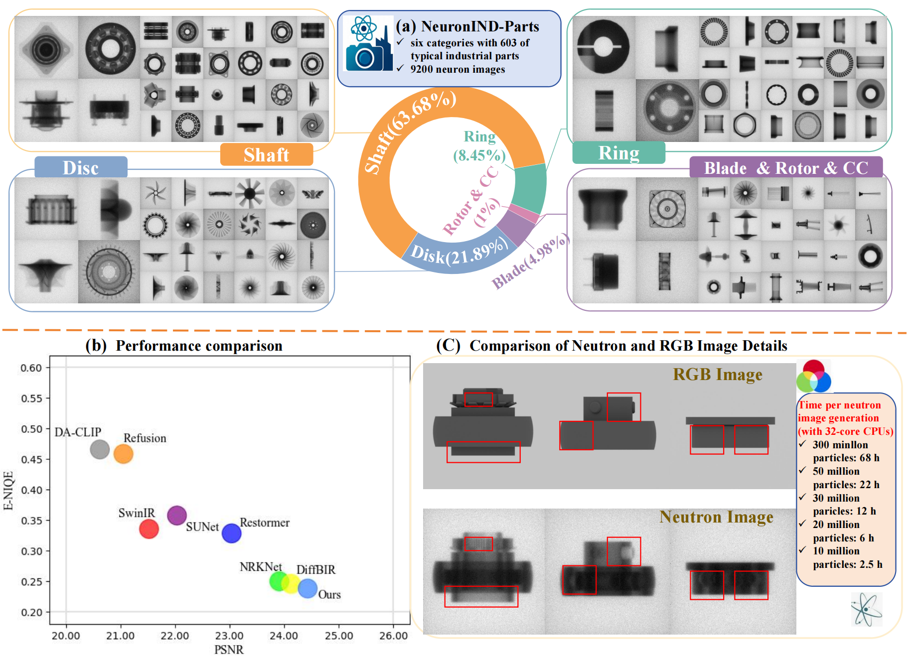
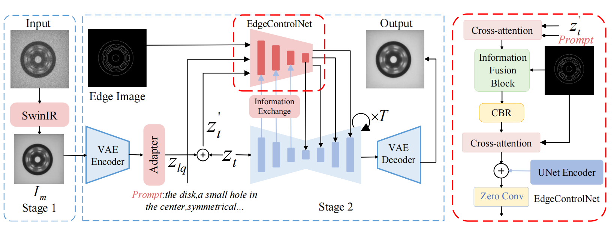
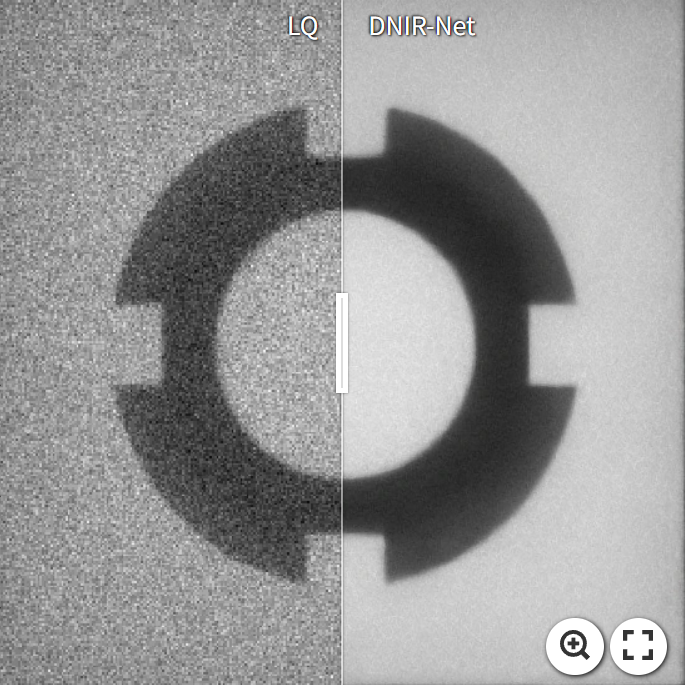
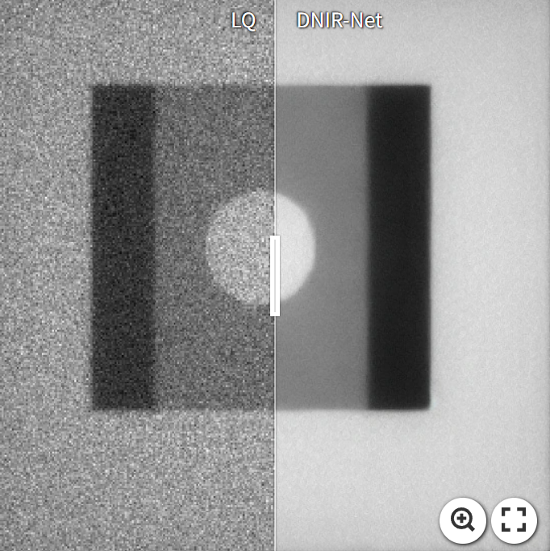
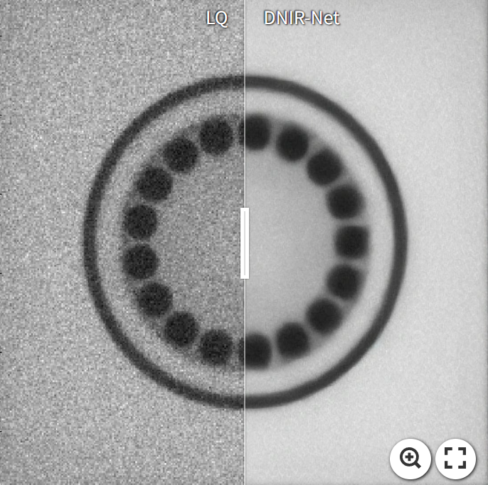
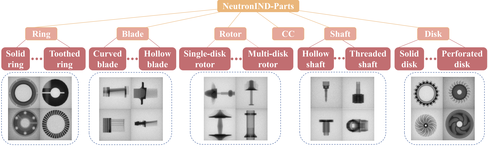

# DNIR-Net: Dual-Stage Restoration Method for Neutron Imaging with Industrial Benchmark Dataset

[Paper](https://arxiv.org/abs/) 

<p align="center">
    
</p>

---

<p align="center">
    
</p>

# Visual Results On Neutron Images
[](https://imgsli.com/MzgzMTY5)
[](https://imgsli.com/MzgzMTcw)
[](https://imgsli.com/MzgzMTcx)

# Installation
```
# clone DNIR-Net repository
git clone https://github.com/DNIRNet516/DNIR-Net.git
cd DNIR-Net

# create environment
conda create -n DNIR_Net python=3.10
conda activate DNIR_Net
pip install -r requirements.txt
```

# NeutronIND-Parts Dataset
<p align="center">
    
</p>

Dounload: NeutronIND-Parts dataset can be downloaded from .

# Pretrained Models
We provide the pretrained weights of the second-stage model (EdgeControlNet), as well as the SwinIR model we trained for degradation removal during Stage 2 training.During inference, the SwinIR model is employed as the first-stage restoration module, while the trained EdgeControlNet remains fixed across all tasks.

| Model Name | Description | HuggingFace | BaiduNetdisk | 
| :---------: | :----------: | :----------: | :----------: |
| EdgeControlNet | EdgeControlNet trained on NeutronIND-Parts Dataset | [download](https:) | N/A |
| SwinIR | SwinIR trained on NeutronIND-Parts Dataset | [download](https:) | N/A |

# Inference
```
python -u inference.py \
--upscale 1 \
--version custom \
--train_cfg configs/train/train_stage2.yaml \
--ckpt experiment \
--captioner none \
--cfg_scale 1.0 \
--noise_aug 0 \
--input datasets \
--edge_path datasets \
--output results \
--precision fp32 \
--sampler spaced \
--steps 50 \
--pos_prompt '' \
--neg_prompt 'low quality, blurry, low-resolution, noisy, unsharp, weird textures' 
```

# Train DNIR-Net
Stage 1:
Train a SwinIR model, which will be used for degradation removal during Stage 1 training.
<a name="gen_file_list"></a>
1. Generate file list of training set and validation set, a file list looks like:

    ```txt
    /path/to/image_1
    /path/to/image_2
    /path/to/image_3
    ...
    ```

    You can write a simple python script or directly use shell command to produce file lists. Here is an example:
    
    ```shell
    # collect all iamge files in img_dir
    find [img_dir] -type f > files.list
    # pick train_size files in the front as training set
    head -n [train_size] files.list > files_train.list
    # pick remaining files as validation set
    tail -n +[train_size + 1] files.list > files_val.list
    ```

2. Fill in the [training configuration file](configs/train/train_stage1.yaml) with appropriate values.

3. Start training!

    ```shell

    accelerate launch train_stage1.py --config configs/train/train_stage1.yaml
    ```

Stage 2:
1. Download pretrained [Stable Diffusion v2.1](https://huggingface.co/stabilityai/stable-diffusion-2-1-base) to provide generative capabilities. :bulb:: If you have ran the [inference script](inference.py), the SD v2.1 checkpoint can be found in [weights](weights).

    ```shell
    wget https://huggingface.co/stabilityai/stable-diffusion-2-1-base/resolve/main/v2-1_512-ema-pruned.ckpt --no-check-certificate
    ```

2. Generate file list as mentioned [above](#gen_file_list).

3. Fill in the [training configuration file](configs/train/train_stage2.yaml) with appropriate values.

4. Start training!

    ```shell
    accelerate launch train_stage2.py --config configs/train/train_stage2.yaml
    ```

# Acknowledgement
This project is based on DiffBIR and SwinIR. Thanks for their awesome work.

